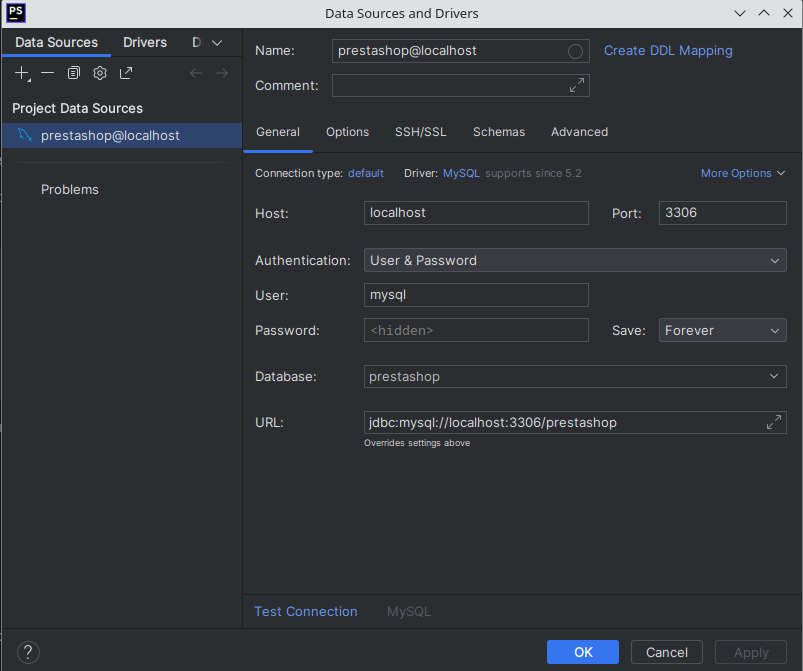
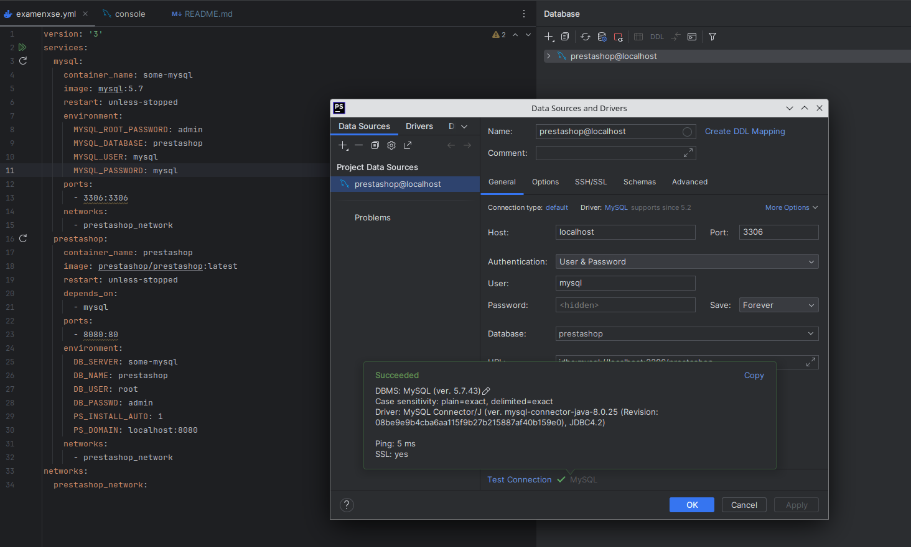

# EXAMEN DOCKER XSE

---

### Crear archivo de docker-compose

Usando el IDE que se quiera, en este caso PHPStorm
(siendo otra opción Visual Studio), creamos un nuevo proyecto
en el que crearemos un archivo .yml

En mi caso examenxse.yml.

### Configuración del Docker Compose

Dentro del docker-compose, crearemos 2 containers:

#### Prestashop:

Primero declararemos el container de prestashop, 
este es la configuración:

```
prestashop:
container_name: prestashop
image: prestashop/prestashop:latest
restart: unless-stopped
depends_on:
- mysql
ports:
- 8080:8080
environment:
DB_SERVER: some-mysql
DB_NAME: prestashop
DB_USER: root
DB_PASSWD: admin
PS_INSTALL_AUTO: 1
PS_DOMAIN: localhost:8080
networks:
- prestashop_network
```

Siendo:

 - container_name: El nombre del contenedor
 - image: La imagen de prestashop que usaremos
 - restart: Cuando se reiniciara el container
 - depends_on: La base de datos que usaremos
 - ports: El puerto en el que se hosteara el servicio de prestashop
 - enviroment: Son propiedades varias de prestashop como: usuario, contraseña, etc....
 - networks: La network usada para conectar prestashop con su db

#### Mysql

Ahora declararemos el container mysql que sera usado por prestashop,
este es la configuración:

```
  mysql:
    container_name: some-mysql
    image: mysql:5.7
    restart: unless-stopped
    environment:
      MYSQL_ROOT_PASSWORD: admin
      MYSQL_DATABASE: prestashop
```

Siendo:

- container_name: El nombre del contenedor
- image: La imagen de mysql que usaremos
- restart: Cuando se reiniciara el container
- ports: El puerto en el que se hosteara el servicio de MySql
- enviroment: Son propiedades varias de MySql como: usuario, contraseña, etc....

#### Network

Declararemos tambíen la Network que se usara entre MySql y Prestashop.

```
networks:
  prestashop_network:
```

### Enlazar DB con PHPStorm

Crearemos una base de MySql usando la UI de PHPStorm,
y procederemos a configurar sus propiedades.



Para que esto funcione, añadiremos estos parametros a nuestro
ya declarado MySql.

```
      MYSQL_USER: mysql
      MYSQL_PASSWORD: mysql
    ports:
      - 3306:3306
```

Que modificaran un usuario dentro de la DB, ademas de su contraseña,
y los puertos usados para conectarse a la DB, igualandolos a los que
hemos usado en la configuración de PHPStorm DB.

Y comprobamos que funcione:

